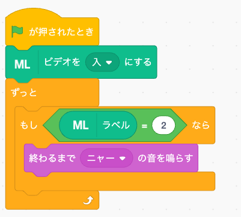

# 機械学習 (xcx-ml)

カメラの画像を機械学習で認識する [Xcratch](https://xcratch.github.io/) 用拡張機能です。
学習済み MobileNet (v2, alpha=0.5) の特徴量を KNN 分類器で分類する転移学習方式なので、数枚の画像を学習させるだけですぐに認識できます。

## 使い方

[Xcratch](https://xcratch.github.io/editor/) または [Stretch3](https://stretch3.github.io/) の「拡張機能を読み込む」で次の URL を指定してください。

```
https://asondemita.github.io/xcx-ml/dist/xcx-ml.mjs
```

## サンプルプログラム

ジャンケン(グー・チョキ・パー)を認識するサンプル [examples/sample.sb3](examples/sample.sb3) を使って、基本的な使い方を説明します。

次のリンクをクリックすると、サンプルを Xcratch で直接開けます。

▶ [サンプルを Xcratch で開く](https://xcratch.github.io/editor/#https://asondemita.github.io/xcx-ml/examples/sample.sb3)

### 1. 緑の旗をクリック

カメラ画像がステージに表示されます(初回はブラウザがカメラの使用許可を求めてきます)。

### 2. ラベルの学習

ジャンケンを学習します(ラベル1=グー/ラベル2=チョキ/ラベル3=パー)。

- a. カメラにグーが映る状態にして「ラベル1を学習する」をクリックします。ステージ左上の「機械学習: ラベル」が 1 になるまで何回もクリックします。
- b. カメラにチョキが映る状態にして「ラベル2を学習する」を「機械学習: ラベル」が 2 になるまでクリックします。
- c. カメラにパーが映る状態にして「ラベル3を学習する」を「機械学習: ラベル」が 3 になるまでクリックします。

初回のクリック時は「環境構築に少し時間がかかります…」と表示され、動き出すまで少し待ちます(約9MBのダウンロードが発生します)。

### 3. 学習の確認

カメラにグー/チョキ/パーを見せると、ラベルが 1/2/3 と変わればOKです。

- ※うまく変わらない時: 例えばチョキがうまく判定できない時は、チョキをカメラに見せて、ラベルが 2 になるまで「ラベル2を学習する」を何度もクリックします(追加学習)。
- ※間違えた場合: 「学習をリセット」をクリックして始めから行ってください。

### 4. 学習したデータを活用

例: チョキを出した時にニャーと鳴くプログラム



うまく学習できた内容は「学習データを保存」でファイルに保存しておき、次回は「学習データを読み込む」で復元すると、学習し直さずにすぐ使えます。

## ブロック

| ブロック | 種類 | 説明 |
| --- | --- | --- |
| ラベル1を学習する | コマンド | 現在のカメラ画像をラベル1の例として学習する |
| ラベル2を学習する | コマンド | 現在のカメラ画像をラベル2の例として学習する |
| ラベル3を学習する | コマンド | 現在のカメラ画像をラベル3の例として学習する |
| ラベル | 値 | 現在のカメラ画像を分類したラベルを返す (未学習のときは空) |
| 学習をリセット | コマンド | 学習した例をすべて消去する |
| 学習データを保存 | コマンド | 学習内容を JSON ファイルとしてダウンロードする |
| 学習データを読み込む | コマンド | JSON ファイルから学習内容を復元する |
| ビデオを[入/切]にする | コマンド | ステージのビデオ表示とカメラを制御する |

## 特徴

- TensorFlow.js / MobileNet / KNN 分類器は **最初に ML ブロックを使ったときに CDN からロード** します。拡張を追加しただけではメモリをほとんど消費せず、カメラも起動しません。
- 分類は「ラベル」ブロックが評価されたときだけ実行します (常時分類ループなし)。
- 推論のたびに生成されるテンソルを毎回解放するため、**長時間使ってもメモリが増え続けません**。
- 特徴抽出は MobileNet v2 (alpha=0.5) で、モデルサイズは約 7.5MB です。

初回の ML ブロック実行時に `cdn.jsdelivr.net` と `tfhub.dev` から合計約 9MB のダウンロードが発生します (要インターネット接続)。

## 開発

```bash
# 隣のディレクトリに xcratch/scratch-gui が必要です
npm run register   # scratch-gui に拡張を登録
npm run start      # 開発サーバー (http://localhost:8601)
npm run build      # dist/xcx-ml.mjs をビルド
```

## ライセンス

MIT
